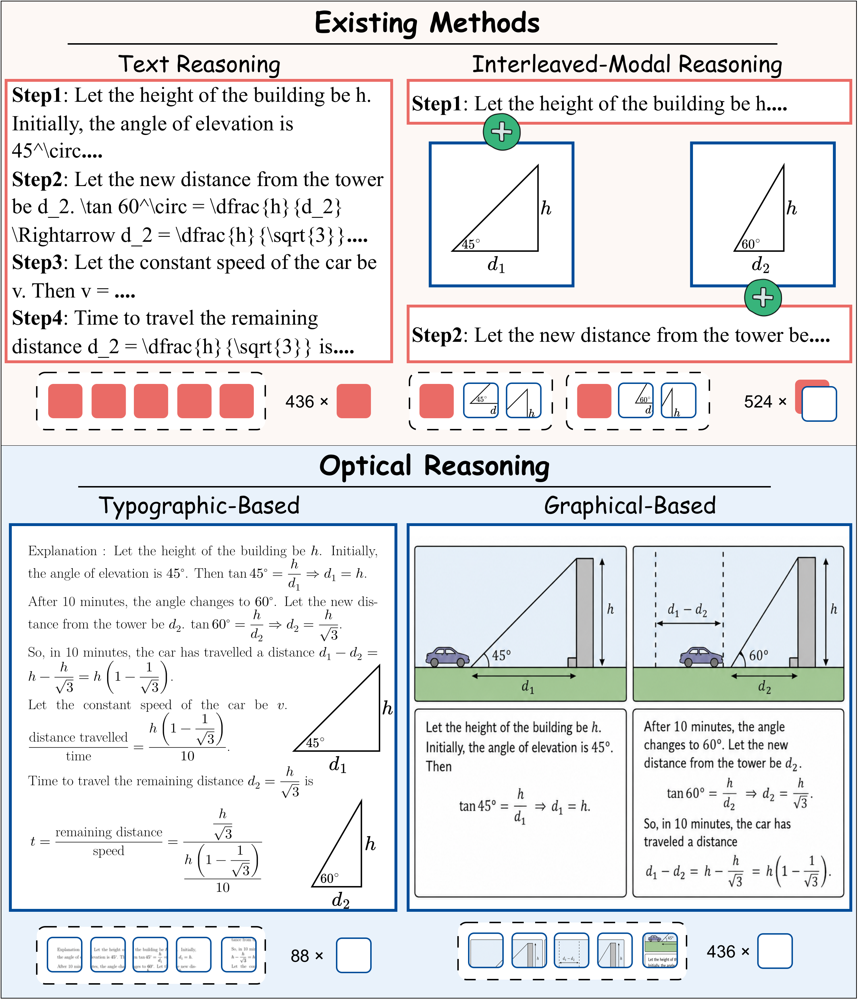

<a name="readme-top"></a>

<div align="center">
  <h1 align="center">Optical Reasoning: Rethinking Images as an Expressive Reasoning Medium Beyond Text</h1>
</div>

<div align="center">
  <!-- Paper Link -->
  <a href="">
    
  </a>

  <!-- Dataset Link -->
  <a href="https://huggingface.co/datasets/ModalityDance/Optical-Reasoning">
    
  </a>
</div>

---

Welcome to **Optical Reasoning**! 👋 This repository accompanies *"Optical Reasoning: Rethinking Images as an Expressive Reasoning Medium Beyond Text"*, a framework that treats images as a standalone reasoning medium. It supports typographic-based optical reasoning for compact rationale rendering and graphical-based optical reasoning for structured visual rationales. The repository also provides scripts for preparing reasoning data and reproducing experiment results.



### 🪐 Key Features

🧭 **Typographic-Based Optical Reasoning**  
T-OR renders the interleaved-modal rationale sequence into a compact typographic image with XeLaTeX.

🌌 **Graphical-Based Optical Reasoning**  
G-OR transforms the interleaved-modal rationale sequence into a unified image-based rationale that organizes reasoning with text, graphical elements, and spatial layouts.

## 🔥 News

<div style="max-height: 240px; overflow-y: auto;">

- **[2026.06]** Initial release of Optical Reasoning.

</div>

## 📑 Table of Contents <span id="table-of-contents"></span>

* [🚀 Quick Start](#quick-start)
  * [1. Installation](#installation)
    * [Create environment](#install-env)
    * [Install XeLaTeX](#install-xelatex)
    * [Model profiles](#install-profiles)
  * [2. Reasoning Data](#reasoning-data)
    * [Prepare Your Own Data](#reasoning-data-prepare)
    * [T-OR Reasoning Data](#reasoning-data-tor)
    * [G-OR Reasoning Data](#reasoning-data-gor)
  * [3. Inference](#inference)
    * [Image reasoning](#inference-image)
    * [Text baselines](#inference-text)
* [🗂️ Project Structure](#project-structure)
* [🌱 Acknowledgements](#acknowledgements)
* [📚 Citation](#citation)

## 🚀 Quick Start <span id="quick-start"></span>

### 1. Installation <span id="installation"></span>

#### Create environment <span id="install-env"></span>

```bash
conda create -n optical-reasoning python=3.11 -y
conda activate optical-reasoning

pip install -U pip
pip install -r requirements.txt
```

#### Install XeLaTeX <span id="install-xelatex"></span>

The renderer is implemented with XeLaTeX.

```bash
# Ubuntu / Debian
apt-get update
apt-get install -y texlive-xetex texlive-latex-extra texlive-fonts-recommended

# macOS
brew install --cask mactex-no-gui
```

Check the installation:

```bash
xelatex --version
```

#### Model profiles <span id="install-profiles"></span>

```bash
cp src/configs/profiles_example.yaml src/configs/profiles.yaml
```

```yaml
models:
  gpt5.1:
    api_key: ""
    base_url: ""
    model: "gpt-5.1-2025-11-13"
    temperature: 0.0
  llmjudge:
    api_key: ""
    base_url: ""
    model: "deepseek-chat"
    temperature: 0.0
  nano-banana-pro:
    api_key: ""
    base_url: ""
    model: "nano-banana-pro"
    temperature: 0.0
```

---

### 2. Reasoning Data <span id="reasoning-data"></span>

> [!TIP]
> The reasoning data used in the paper can be downloaded from the [Optical-Reasoning dataset](https://huggingface.co/datasets/ModalityDance/Optical-Reasoning).

#### Prepare Your Own Data <span id="reasoning-data-prepare"></span>

If you want to build reasoning data from your own rationales, start from the JSONL format below. The `reasoning_token` field is required to specify the target reasoning-token budget for rendering each rationale image.

```json
{
  "id": "sample-001",
  "problem": "Question text.",
  "solution": "Reasoning rationale.",
  "answer": "A",
  "reasoning_token": 512
}
```

The generated T-OR and G-OR reasoning data follow this folder structure:

```plaintext
data/
  └── <dataset>/
      ├── <dataset>.jsonl
      ├── T-OR/
      │   ├── output.jsonl
      │   └── images/
      └── G-OR/
          ├── output.jsonl
          └── images/
```

#### T-OR Reasoning Data <span id="reasoning-data-tor"></span>

T-OR renders the rationale into a compact typographic image while preserving the original order of the reasoning content.

```bash
DATASET=aqua_rat \
INPUT_JSONL=data/aqua_rat/aqua_rat.jsonl \
OUTPUT_DIR=data/aqua_rat/T-OR \
OUTPUT_JSONL=data/aqua_rat/T-OR/output.jsonl \
bash scripts/render_typographic.sh
```

<details>
<summary>What this script does?</summary>

- Reads rationales from the `solution` field.
- Searches for a compact and readable typographic layout under the `reasoning_token` budget.
- Writes rendered images and an updated `output.jsonl` with reasoning image paths.

</details>

#### G-OR Reasoning Data <span id="reasoning-data-gor"></span>

G-OR generates a structured visual rationale by composing reasoning steps into graphical panels.

```bash
DATASET=aqua_rat \
INPUT_JSONL=data/aqua_rat/aqua_rat.jsonl \
OUTPUT_BASE=data/aqua_rat/G-OR \
OUTPUT_JSONL=data/aqua_rat/G-OR/output.jsonl \
PROFILE=nano-banana-pro \
bash scripts/render_graphical.sh
```

<details>
<summary>What this script does?</summary>

- Uses the configured generation profile, such as `PROFILE=nano-banana-pro`.
- Converts the problem, rationale, and optional visual inputs into a step-aligned graphical rationale.
- Writes generated images and an updated `output.jsonl` with reasoning image paths.

</details>

---

### 3. Inference <span id="inference"></span>

#### Image reasoning <span id="inference-image"></span>

For optical reasoning, T-OR takes the problem text together with the rendered typographic rationale image, while G-OR takes the problem text together with the generated graphical rationale image.

Run inference on T-OR:

```bash
PROFILE=gpt5.1 \
INPUT_JSONL=data/aqua_rat/T-OR/output.jsonl \
OUTPUT_DIR=outputs/aqua_rat/T-OR \
OUTPUT_JSONL=outputs/aqua_rat/T-OR/infer_gpt5.1.jsonl \
bash scripts/infer_typographic.sh
```

Run inference on G-OR:

```bash
PROFILE=gpt5.1 \
INPUT_JSONL=data/aqua_rat/G-OR/output.jsonl \
OUTPUT_DIR=outputs/aqua_rat/G-OR \
OUTPUT_JSONL=outputs/aqua_rat/G-OR/infer_gpt5.1.jsonl \
bash scripts/infer_graphical.sh
```

#### Text baselines <span id="inference-text"></span>

Text reasoning receives the problem followed by the rationale, and free reasoning asks the model to solve the problem step by step.

```bash
python src/run.py infer \
  --data data/<dataset>/<dataset>.jsonl \
  --output outputs/<dataset>/text_reasoning/infer_<model>.jsonl \
  --profile <model> \
  --task-type text_reasoning
```

Use `--task-type no_reasoning` or `--task-type free_reasoning` for the other text baselines.

<details>
<summary>Key args meaning</summary>

- `--data`: input JSONL file
- `--output`: output prediction JSONL path
- `--profile`: model profile name in `src/configs/profiles.yaml`
- `--task-type`: reasoning mode, including `no_reasoning`, `free_reasoning`, `text_reasoning`, and `img_reasoning`

</details>

---

## 🗂️ Project Structure <span id="project-structure"></span>

```plaintext
├── scripts/
│   ├── render_typographic.sh
│   ├── render_graphical.sh
│   ├── infer_typographic.sh
│   └── infer_graphical.sh
│
└── src/
    ├── run.py
    ├── configs/
    │   └── profiles_example.yaml
    ├── inference/
    │   ├── predictor.py
    │   └── evaluation.py
    ├── render/
    │   ├── typographic_render.py
    │   └── graphical_render.py
    └── utils/
```

## 🌱 **Acknowledgements** <span id="acknowledgements"></span>

[](https://xetex.sourceforge.net/)

This project is licensed under the **MIT License**. Please refer to the [LICENSE](./LICENSE) file for more details.

## 📚 **Citation** <span id="citation"></span>

```bibtex
@misc{opticalreasoning2026,
  title        = {Optical Reasoning: Rethinking Images as an Expressive Reasoning Medium Beyond Text},
  year         = {2026}
}
```

---

<div align="center">

<a href="">
  
</a>

<a href="">
  
</a>

</div>
